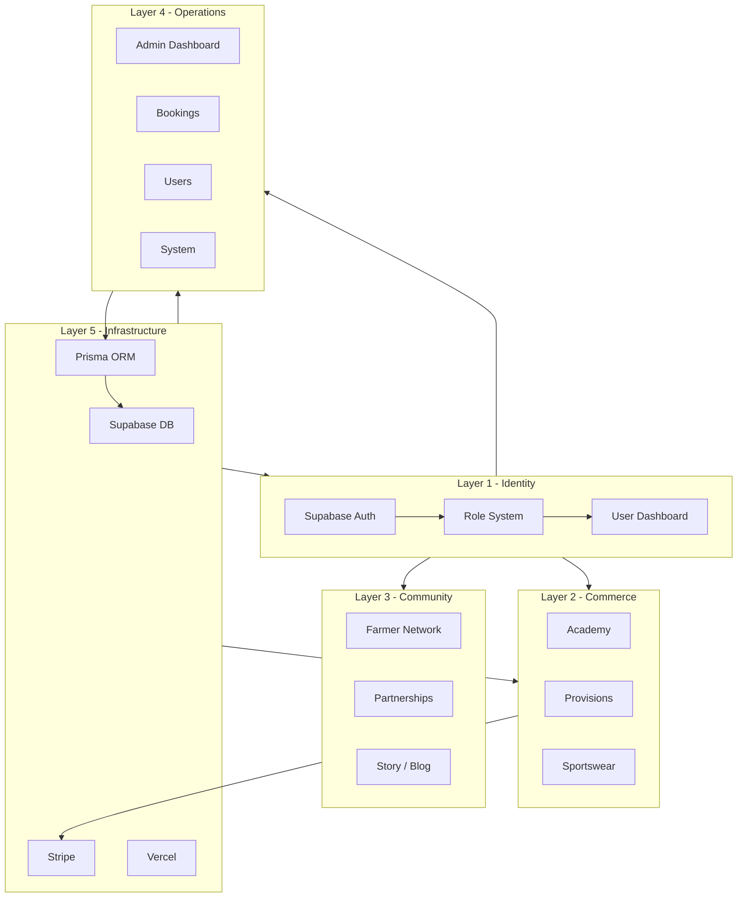

# Bornfidis Platform Architecture — Implementation Plan

## Goal

Refactor the Bornfidis platform into a **clearly mapped, modular layer architecture** so technology decisions and growth (Academy → Provisions → Farmer marketplace → Sportswear) align with one control map. Implementation will **improve structure and navigation without breaking existing functionality**, keeping Supabase Auth and Prisma as-is.

---

## Current state vs target (summary)

| Layer              | Doc target                                                          | Current implementation                                                                                                                                                                                                                                                                                                       |
| ------------------ | ------------------------------------------------------------------- | ---------------------------------------------------------------------------------------------------------------------------------------------------------------------------------------------------------------------------------------------------------------------------------------------------------------------------- |
| **Identity**       | Supabase Auth, roles (ADMIN/STAFF/COORDINATOR/USER), user dashboard | In place: [lib/auth.ts](lib/auth.ts), [lib/requireAdmin.ts](lib/requireAdmin.ts), [lib/get-user-role.ts](lib/get-user-role.ts), [app/(auth)/admin/login](app/(auth)/admin/login), Prisma `User` + role; dashboard = My Library + role-specific (chef/farmer/partner)                                                         |
| **Commerce**       | Academy, Provisions, Sportswear                                     | Academy: [app/academy](app/academy), [lib/academy-products.ts](lib/academy-products.ts), Stripe + Prisma. Provisions: [app/book](app/book). Sportswear: [app/sportswear](app/sportswear), [lib/sportswear-products.ts](lib/sportswear-products.ts) (preview).                                                                |
| **Community**      | Farmer network, Partnerships, Story/Blog                            | Farmers: [app/farmers](app/farmers), [app/farmer-intake](app/farmer-intake), [app/portland](app/portland). Partners: [app/partners](app/partners), [app/cooperative](app/cooperative). Story: [app/story](app/story); blog-style: [app/stories](app/stories).                                                                |
| **Operations**     | Admin dashboard, users, bookings, orders, system                    | Admin: [app/admin](app/admin) (redirects to bookings), [app/admin/users](app/admin/users), [app/admin/bookings](app/admin/bookings), [app/admin/academy](app/admin/academy) (Academy sales). No dedicated `/admin/dashboard` or `/admin/orders` or `/admin/system`. [lib/nav-config.ts](lib/nav-config.ts) drives admin nav. |
| **Infrastructure** | Supabase DB, Prisma, Stripe, storage, Vercel                        | In place: [lib/db.ts](lib/db.ts), [lib/supabase.ts](lib/supabase.ts), [lib/stripe.ts](lib/stripe.ts), [lib/academy-storage.ts](lib/academy-storage.ts), Vercel config.                                                                                                                                                       |

**Public nav today:** Home, Provisions (/book), Marketplace, Impact, Our Story (/story), Academy (dropdown), Sportswear, My Library, Login.  
**Doc target nav:** Home, Academy, Marketplace, Sportswear, Farmers, Story, Admin.

**Gaps:** (1) No single architecture doc that maps layers to code. (2) Public nav missing **Farmers** as top-level; has Impact and Provisions not in the doc’s minimal list. (3) Admin has no **System** entry and no **Dashboard** landing; **Orders** could be Academy sales (already under /admin/academy) or a dedicated /admin/orders.

---

## 1. Add the architecture document (single source of truth)

**Deliverable:** New file `docs/BORNFIDIS_PLATFORM_ARCHITECTURE.md`.

**Contents:**

- **CEO-view diagram** (text/ASCII or Mermaid): the five layers (Identity, Commerce, Community, Operations, Infrastructure) and how they connect.
- **Layer 1 — Identity:** Purpose; tools (Supabase Auth, Prisma User, role guards); roles (ADMIN, STAFF, COORDINATOR, USER); pointer to `lib/auth.ts`, `lib/requireAdmin.ts`, `lib/get-user-role.ts`, `app/(auth)/admin/login`, and user-facing “dashboard” (My Library + role dashboards).
- **Layer 2 — Commerce:** Three branches (Academy, Provisions, Sportswear); for each: purpose, routes, key libs (e.g. academy-products, sportswear-products, book page), and Stripe/Prisma usage.
- **Layer 3 — Community:** Farmer network, Partnerships, Story/Blog; routes and key files (farmers, farmer-intake, partners, cooperative, story, stories).
- **Layer 4 — Operations:** Admin dashboard, users, bookings, orders (Academy), system; list admin routes and [lib/nav-config.ts](lib/nav-config.ts); note that “orders” = Academy sales in /admin/academy unless a separate /admin/orders is added.
- **Layer 5 — Infrastructure:** Stack (Next.js, Supabase, Prisma, Postgres, Stripe, Vercel); references to [lib/db.ts](lib/db.ts), [lib/supabase.ts](lib/supabase.ts), [lib/stripe.ts](lib/stripe.ts), storage, deployment.
- **Flywheel:** Short description (Content → Trust → Community → Products → Revenue → Farm network → Stories → Content).
- **Revenue phases:** Phase 1 Academy, Phase 2 Spices, Phase 3 Farmer marketplace, Phase 4 Sportswear (as in doc).

No code moves in this step; the doc is the map from “vision” to “where it lives in the repo.”

---

## 2. Align public navigation with the architecture

**File:** [components/layout/PublicNav.tsx](components/layout/PublicNav.tsx).

**Target order and items (doc):** Home, Academy, Marketplace, Sportswear, Farmers, Story, Admin (Login).

**Changes:**

- Add **Farmers** as a top-level link (href `/farmers`) in both desktop and mobile nav, in the position specified by the doc (e.g. after Sportswear).
- Rename **“Our Story”** to **“Story”** (still link to `/story`) to match the doc and reduce clutter.
- **Reorder** main nav so the primary order matches: Home → Academy (dropdown) → Marketplace → Sportswear → Farmers → Story. Keep **My Library** and **Login** at the end (Login = “Admin” entry point for the doc).
- **Impact** and **Provisions:** Doc says “avoid clutter” and lists six items + Admin. Options: (a) Remove Impact and Provisions from the main nav and add them to footer or a “More” dropdown; (b) Keep them in nav but after Story. Recommendation: keep **Provisions** in main nav (commerce pillar) and **Impact** in main nav (community/impact), unless you explicitly want the minimal six; then remove or move to footer. Plan will assume we **keep both** but **add Farmers** and **rename Our Story → Story**; you can remove Impact/Provisions in a follow-up if desired.
- Ensure **mobile** nav mirrors the same links and order.

**Footer:** [components/layout/PublicFooter.tsx](components/layout/PublicFooter.tsx) already has Farmers, Story, Sportswear, Marketplace; ensure “Our Story” is updated to “Story” there too if we rename in nav.

---

## 3. Ensure admin structure: users, bookings, system (and optional dashboard/orders)

**Files:** [lib/nav-config.ts](lib/nav-config.ts), optionally new routes under `app/admin`.

**Required (doc):** Admin tools under `/admin`: users, bookings, system.

**Current:** `/admin` redirects to `/admin/bookings`. [lib/nav-config.ts](lib/nav-config.ts) already has Users (Settings → /admin/users), Bookings (/admin/bookings), and many other items. There is no “System” entry; ops/health-style content lives in /admin/ops.

**Changes:**

- **System:** Add a **“System”** nav item in [lib/nav-config.ts](lib/nav-config.ts) pointing to a new route `/admin/system`, visible to ADMIN (and optionally STAFF). Create `app/admin/system/page.tsx`: simple page that shows “System” (e.g. health summary: link to existing `/api/health`, env checklist status, or “Operational” message). Reuse existing health API; no new backend required. Alternatively, if you prefer not to add a new route, add a nav item “System” that links to `/admin/ops` and document that “System” = Ops for now.
- **Dashboard (optional):** Doc mentions `/admin/dashboard`. Current behavior: `/admin` → redirect to `/admin/bookings`. Options: (1) Add `app/admin/dashboard/page.tsx` with a simple dashboard (cards linking to Users, Bookings, Academy/Orders, System) and change `/admin` to redirect to `/admin/dashboard` instead of `/admin/bookings`; or (2) Keep redirect to bookings and document in the architecture doc that “dashboard” = /admin (landing = bookings). Plan recommends (2) to avoid scope creep unless you want a dedicated dashboard landing.
- **Orders:** Doc mentions “admin/orders.” Academy sales are under `/admin/academy`. Either document that “Orders” = Academy sales at `/admin/academy`, or add a nav item “Orders” that links to `/admin/academy` (label “Academy / Orders”). No new route required if we only relabel or document.

**Concrete steps:**

1. Add **System** to [lib/nav-config.ts](lib/nav-config.ts): `{ label: 'System', href: '/admin/system', roles: [UserRole.ADMIN] }` (or STAFF if you want).
2. Create **app/admin/system/page.tsx**: minimal page (e.g. title “System”, link to `/api/health`, optional env checklist or “Operational” text). No breaking changes to existing admin layout.
3. In the architecture doc, state that “Dashboard” = `/admin` (redirects to bookings) and “Orders” = Academy sales at `/admin/academy`.

---

## 4. Optional: Lightweight code structure by layer (no URL changes)

**Goal:** Make the five layers visible in the repo without moving routes (so nothing breaks).

**Option A (recommended):**  

- In `docs/BORNFIDIS_PLATFORM_ARCHITECTURE.md`, add a short “File and folder map” section: table or list of app routes and key lib files by layer (Identity, Commerce, Community, Operations, Infrastructure). No file moves.
- Optionally add a one-line comment at the top of key layout or entry files (e.g. `app/admin/layout.tsx`: “Operations layer — admin control center”) so future edits stay layer-aware.

**Option B (larger refactor):**  

- Use Next.js route groups, e.g. `app/(identity)/...`, `app/(commerce)/academy`, `app/(operations)/admin`, so that URLs stay the same but folders are grouped by layer. This touches many files and is not required to “see how everything fits together”; recommend only if you later want folder-by-layer structure.

**Plan scope:** Implement Option A only (doc + optional comments). Option B left for a future iteration.

---

## 5. What we are not changing

- **Supabase Auth** and **Prisma** usage: unchanged.
- **Existing routes and APIs:** No removals or URL renames; only additive (e.g. /admin/system) or nav/label changes.
- **Role definitions:** Already ADMIN, STAFF, COORDINATOR, USER; no schema or guard changes.
- **Commerce logic:** Academy, book (Provisions), sportswear behavior unchanged; only nav and docs.

---

## 6. Deliverables summary

| #   | Deliverable            | Action                                                                                                                                                                                                                                                                           |
| --- | ---------------------- | -------------------------------------------------------------------------------------------------------------------------------------------------------------------------------------------------------------------------------------------------------------------------------- |
| 1   | Architecture doc       | Create [docs/BORNFIDIS_PLATFORM_ARCHITECTURE.md](docs/BORNFIDIS_PLATFORM_ARCHITECTURE.md) with five layers, flywheel, revenue phases, and file/route map.                                                                                                                        |
| 2   | Public nav             | Update [PublicNav.tsx](components/layout/PublicNav.tsx): add Farmers, rename Our Story → Story, reorder to Home, Academy, Marketplace, Sportswear, Farmers, Story; align mobile. Optionally update [PublicFooter.tsx](components/layout/PublicFooter.tsx) “Our Story” → “Story”. |
| 3   | Admin System           | Add “System” to [lib/nav-config.ts](lib/nav-config.ts) and create [app/admin/system/page.tsx](app/admin/system/page.tsx) (minimal health/ops view).                                                                                                                              |
| 4   | Admin dashboard/orders | Document only: dashboard = /admin (→ bookings), orders = /admin/academy.                                                                                                                                                                                                         |
| 5   | Layer visibility       | In architecture doc, add “File and folder map” by layer; optionally add one-line layer comments in key files (admin layout, academy layout, story/farmers entry).                                                                                                                |

---

## 7. Diagram (for the architecture doc)

This plan keeps the platform architecture clear and aligned with the CEO view while avoiding breaking changes and keeping implementation scope contained.