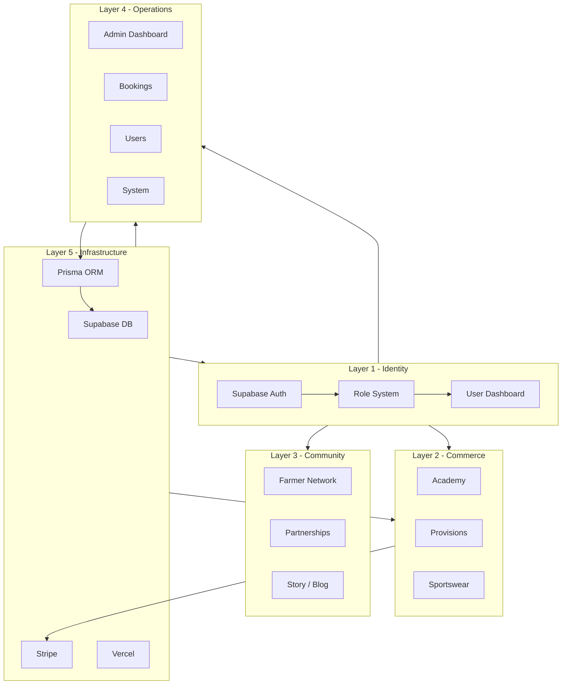

# Bornfidis Platform Architecture

This document maps the Bornfidis digital ecosystem into a five-layer architecture. It guides technology decisions and business growth without changing URLs or breaking existing behavior.

---

## Five-layer architecture

```
BORNFIDIS PLATFORM
│
├── Identity Layer      (who uses the platform)
├── Commerce Layer     (where money enters the ecosystem)
├── Community Layer    (trust engine: farmers, partners, story)
├── Operations Layer   (control center: admin, bookings, system)
└── Infrastructure Layer (stack: Supabase, Prisma, Stripe, Vercel)
```

### Mermaid diagram



---

## Flywheel (growth engine)

Content → Trust → Community → Products → Revenue → Farm network → Stories → Content

- **Content:** Academy, Story, blog.
- **Trust:** Consistent brand, quality products, farmer/partner relationships.
- **Community:** Farmer network, partnerships, cooperative.
- **Products:** Academy, Provisions, Sportswear.
- **Revenue:** Sales from commerce layer.
- **Farm network:** More farmers and partners.
- **Stories:** More content and authority.
- Loop repeats.

---

## Revenue phases

| Phase | Focus | Status |
|-------|--------|--------|
| Phase 1 | Academy (digital products) | Live |
| Phase 2 | Provisions / Spices (food brand) | In place (Provisions page) |
| Phase 3 | Farmer marketplace | Roadmap |
| Phase 4 | Sportswear store | Preview / coming soon |

---

## Dashboard and orders (admin)

- **Dashboard:** The admin landing is `/admin`. It redirects to `/admin/bookings`. There is no separate `/admin/dashboard` route; “dashboard” = `/admin` (redirect to bookings).
- **Orders:** Academy sales and order tracking live under **`/admin/academy`**. There is no separate `/admin/orders` route; “orders” = Academy sales at `/admin/academy`.

---

## Layer 1 — Identity

**Purpose:** Manage users and permissions.

**Roles:** ADMIN, STAFF, COORDINATOR, USER.

**Files and routes:**

| What | Location |
|------|----------|
| Auth (Supabase) | `lib/auth.ts`, `lib/supabase.ts` |
| Role guards | `lib/requireAdmin.ts`, `lib/authz.ts`, `lib/get-user-role.ts` |
| Login | `app/(auth)/admin/login/page.tsx` |
| User/role model | Prisma `User` (role field) |
| User-facing dashboards | `/dashboard/library` (My Library), `/chef`, `/farmer`, `/partner` |

---

## Layer 2 — Commerce

**Purpose:** Where money enters the ecosystem.

**Branches:**

1. **Academy** — Digital products (guides, courses). Stripe checkout, Prisma purchases, secure downloads.
2. **Provisions** — Food brand (spices, sauces). `/book` and related.
3. **Sportswear** — Apparel (preview/coming soon). `/sportswear`.

**Files and routes:**

| What | Location |
|------|----------|
| Academy catalog | `app/academy/page.tsx`, `app/academy/[slug]/page.tsx`, `lib/academy-products.ts` |
| Academy checkout | `app/api/academy/checkout/route.ts`, `app/api/webhooks/academy/route.ts` |
| Academy storage | `lib/academy-storage.ts`, `app/api/academy/download/[slug]/route.ts` |
| Provisions | `app/book/page.tsx` |
| Sportswear | `app/sportswear/page.tsx`, `lib/sportswear-products.ts` |
| Stripe | `lib/stripe.ts`, `lib/stripe-connect.ts` |

---

## Layer 3 — Community

**Purpose:** Trust engine — farmer network, partnerships, story/blog.

**Files and routes:**

| What | Location |
|------|----------|
| Farmer network | `app/farmers/page.tsx`, `app/farmer-intake/`, `app/farm/apply/`, `app/portland/page.tsx` |
| Partnerships | `app/partners/page.tsx`, `app/cooperative/page.tsx` |
| Story / blog | `app/story/page.tsx`, `app/stories/page.tsx` |
| Farmer APIs | `app/api/farmers/join/route.ts`, `app/api/portland/farmer-join/route.ts` |

---

## Layer 4 — Operations

**Purpose:** Control center for admin: users, bookings, academy/orders, system.

**Files and routes:**

| What | Location |
|------|----------|
| Admin layout | `app/admin/layout.tsx` |
| Admin landing | `app/admin/page.tsx` (redirects to `/admin/bookings`) |
| Users | `app/admin/users/page.tsx`, `app/admin/users/actions.ts` |
| Bookings | `app/admin/bookings/page.tsx`, `app/admin/bookings/actions.ts` |
| Academy (orders) | `app/admin/academy/page.tsx` |
| System | `app/admin/system/page.tsx` |
| Admin nav config | `lib/nav-config.ts` |
| Other admin sections | `app/admin/` (chefs, farmers, payouts, ops, etc.) |

---

## Layer 5 — Infrastructure

**Purpose:** Technology stack that supports all layers.

**Stack:**

- Next.js (App Router)
- Supabase (Auth, optional DB/tables)
- Prisma ORM
- Postgres database (`DATABASE_URL`, `DIRECT_URL`)
- Stripe (payments, Connect)
- File storage (e.g. `storage/academy-products/`, local or cloud)
- Vercel (deployment)

**Files:**

| What | Location |
|------|----------|
| Database | `lib/db.ts`, `prisma/schema.prisma` |
| Supabase | `lib/supabase.ts`, `lib/auth.ts` |
| Stripe | `lib/stripe.ts`, `lib/stripe-connect.ts` |
| Env / config | `.env`, `.env.local`, Vercel env vars |

---

## File and route map by layer

| Layer | Key app routes | Key lib files |
|-------|----------------|---------------|
| Identity | `/admin/login`, `/dashboard/library`, `/chef`, `/farmer`, `/partner` | `auth.ts`, `requireAdmin.ts`, `get-user-role.ts`, `authz.ts` |
| Commerce | `/academy`, `/academy/[slug]`, `/book`, `/sportswear` | `academy-products.ts`, `academy-storage.ts`, `sportswear-products.ts`, `stripe.ts` |
| Community | `/farmers`, `/story`, `/stories`, `/partners`, `/cooperative`, `/farm/apply` | (various actions/APIs under `app/api/`) |
| Operations | `/admin`, `/admin/bookings`, `/admin/users`, `/admin/academy`, `/admin/system` | `nav-config.ts`, `app/admin/*/actions.ts` |
| Infrastructure | (no direct routes) | `db.ts`, `supabase.ts`, `stripe.ts`, Prisma schema |

---

## Public navigation (target order)

Home → Academy → Provisions → Marketplace → Sportswear → Farmers → Story → My Library → Login

Impact is not in the primary nav; it remains available via footer or direct URL `/impact`.
